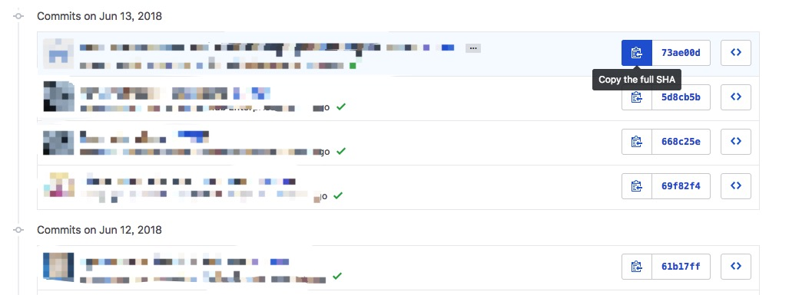
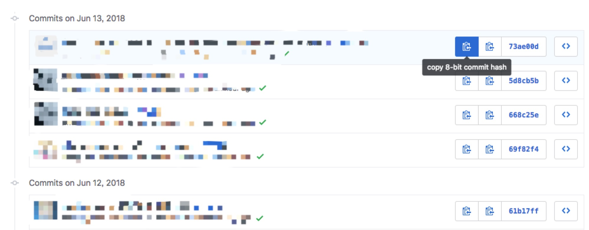

# [github_copy_short_hash](https://github.com/belowfrog/UserScripts/tree/master/github_copy_short_hash)

## Description

Adds button to copy short commit hash.
In commits page, before the copy full hash button.

## Screenshot

### Before

### After

## External links

- [openuserjs](https://openuserjs.org/scripts/belowfrog/copy_8-bit_commit_hash)
